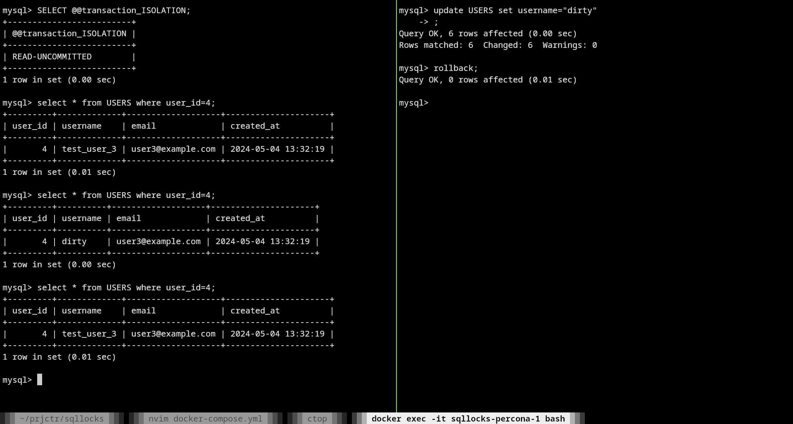

## Lost Update
### Percona

### Postgres

## Dirty Read
### Percona

### Postgres
PostgreSQL's Read Uncommitted mode behaves like Read Committed.(https://www.postgresql.org/docs/current/transaction-iso.html) - so it is not possible to reproduce dirty read in Postgres

## Non-Repeatable Read
### Percona

### Postgres

## Phantom Read
### Percona

### Postgres

